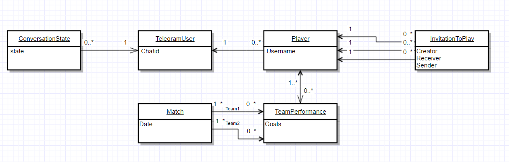

### Purpose

The current projects hosts the [backend code](./bot-back-end) for different **Telegram Bots**:

* FifaBot 
* FuelBot
* IncioBot
* LyricsBot
* GoogleMapBot

Along with the [Web Application](./fifa-bot-gui) to visualize the data aggregations for FifaBot 

### Bots
#### FifaBot

This bot is meant to allow me and my collegues to register our results from the [Fifa 17](https://en.wikipedia.org/wiki/FIFA_17) XBox matches.

The following operations are allowed, amongst others:

* Register as user
* Deactivate the account
* Create an invitation for a game
* Add a new result (this will send a message to the opponent, informing about the result added)
* Delete a match
* Obtain simple statistics

All of this is achieved using [Telegram](https://telegram.org/) bot as UI.

The bot can be found at this [link](https://t.me/EueiFifaBot).

This video shows the bot in action:

#### FifaBot UI

[Vaadin](https://vaadin.com/) has been used to develop a Web Application to visualize graphs and statistics of the matches registered.

This video shows the bot and the WebApp in action:

### GoogleMaps Bot

The purpose of this bot is to update me with information about traffic and fastest way home from work. It is scheduled to send me updates, fetched from Google Maps, from 19 and every 30 minutes until I stop it with a command from Telegram chat.

The advantages from just using Google Maps is that I do not have to reveal my home and work location to Google (I know, it does know it anyway) and allows me to customize the information received in great details.

For example, I configured it to send me the time it takes for two different paths so I can get to decide the one I want to go for:

### LyricsBot

This bot is called by a IFTTT every time I save a song on Spotify.
It retrieves the lyrics from MusixMatch and sends it to me

### Backend

#### Overall structure

This graph shows the internal structure and mechanism implemented using AOP and Spring for how logs work and how a request is handled :

#### Database schema

This image shows the core of the schema, which is mostly related to the functioning of FifaBot

#### Rest APIs

[This document](rest-api.txt) contains the specifications for the apis.

## Usage

The project needs to be build using maven
In order to build the frontend project, a vaadin license is needed (it can be place in the root of the project, for example)

Run this command in the root folder

    mvn package

The projects are now built and the war/jar are in the respective target folders

It is enough to run

    docker-compose up

Both backend, frontend and database will be running.